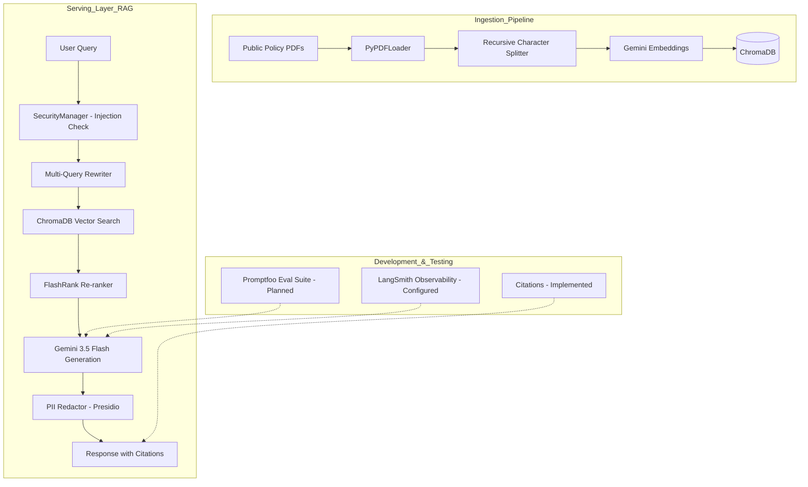

# Architecture Design: Gov-Policy-Insight (Production RAG)

This architecture is designed to meet the **"not just a POC"** requirements of enterprise/government AI roles. It focuses on **deterministic evaluation**, **PII safety**, and **observability**.

## 1. System Overview



## 2. Current Status & Implementation Details

### A. Ingestion (Implemented)
- **Tooling:** `LangChain` with `PyPDFLoader`.
- **Strategy:** Recursive character splitting (1000 chunk size, 200 overlap).
- **Batching:** Implemented 50-chunk batching with 65s delays to respect Google AI Free Tier rate limits (100 RPM).
- **Storage:** Local `ChromaDB` persistence.

### B. Security & Safety (Implemented)
- **PII Redaction:** Integrated Microsoft `Presidio`. Redacts Names, Locations, Emails, etc., before final delivery.
- **Injection Guard:** Regex-based blacklist for common prompt injection patterns (e.g., "ignore all previous instructions").
- **Manager:** Centralized in `src/security.py` and integrated into `RAGChain.run()`.

### C. Retrieval Logic (Implemented)
- **Multi-Query:** Generates 5 variations of the user question to overcome distance-based search limitations.
- **Re-ranking:** Uses `FlashRank` (cross-encoder) to re-sort the top 15 retrieved documents, passing the top 5 most relevant to the LLM.
- **Citations:** Explicitly enforced via system prompt and metadata extraction. Format: `[Source, Page X]`.

### D. Generation (Implemented)
- **Model:** `gemini-3.5-flash` for high-speed, cost-effective reasoning.
- **Embeddings:** `models/gemini-embedding-001`.

## 3. Roadmap (What's Left)

- [ ] **FastAPI/Streamlit Frontend:** Currently, the system is run via `src/chains.py` or test scripts. `src/app.py` needs implementation.
- [ ] **Evaluation Suite:** Setup `Promptfoo` in the `evals/` directory to measure answer relevance and faithfulness.
- [ ] **Memory:** Add conversation buffer memory to support multi-turn policy discussions.
- [ ] **Deployment:** Dockerize the application for cloud deployment.

## 4. GitHub Folder Structure
```text
gov-policy-insight/
├── data/               # NSW Policy PDFs (Cyber, Risk, Climate, etc.)
├── chroma_db/          # Local vector store persistence
├── src/
│   ├── ingestion.py    # PDF Loading & Batched Vectorization
│   ├── chains.py       # Main RAG Pipeline (The "Brain")
│   ├── security.py     # PII & Injection Protection
│   └── app.py          # [TODO] Web Interface Entrypoint
├── tests/              # Unit and integration tests
├── .env                # API Keys & Config (Private)
├── RAG_ARCHITECTURE.md # You are here
└── README.md           # Setup instructions
```
