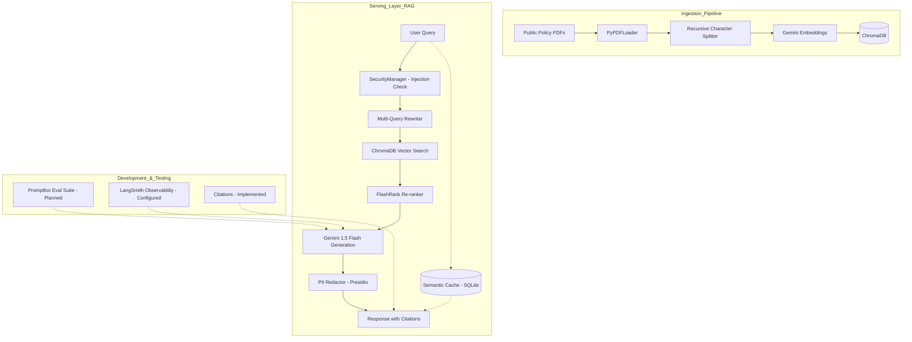

# Architecture Design: Gov-Policy-Insight (Production RAG)

This architecture is designed to meet the **"not just a POC"** requirements of enterprise/government AI roles. It focuses on **deterministic evaluation**, **PII safety**, and **observability**.

## 1. System Overview



## 2. Current Status & Implementation Details

### A. Ingestion (Implemented)
- **Tooling:** `LangChain` with `PyPDFLoader`.
- **Strategy:** Recursive character splitting (1000 chunk size, 200 overlap).
- **Batching:** Implemented 50-chunk batching with 65s delays to respect Google AI Free Tier rate limits (100 RPM).
- **Storage:** Local `ChromaDB` persistence.
- **Location:** `backend/core/ingestion.py`.

### B. Security & Safety (Implemented)
- **PII Redaction:** Integrated Microsoft `Presidio`. Redacts Names, Locations, Emails, etc., before final delivery.
- **Injection Guard:** Blacklist for common prompt injection patterns.
- **Manager:** Centralized in `backend/core/security.py` and integrated into `RAGChain.run()`.

### C. Retrieval Logic (Implemented)
- **Multi-Query:** Generates 5 variations of the user question to overcome distance-based search limitations.
- **Parallel Retrieval:** Executes searches for all query variations in parallel using `ThreadPoolExecutor`.
- **Semantic Caching:** Uses an SQLite-based cache with embedding similarity (0.95 threshold) to skip the RAG pipeline for repetitive or highly similar queries.
- **Re-ranking:** Uses `FlashRank` (cross-encoder) to re-sort the top 15 retrieved documents, passing the top 5 most relevant to the LLM.
- **Citations:** Explicitly enforced via system prompt and metadata extraction. Format: `[Source, Page X]`.

### D. Generation (Implemented)
- **Model:** `gemini-1.5-flash` for high-speed, cost-effective reasoning.
- **Embeddings:** `models/gemini-embedding-001`.

## 3. Roadmap

- [x] **FastAPI Backend:** Implemented in `backend/main.py`.
- [x] **Streamlit Frontend:** Implemented in `frontend/app.py`.
- [x] **Semantic Cache:** Implemented in `backend/core/cache.py`.
- [ ] **Evaluation Suite:** Setup `Promptfoo` in the `evals/` directory to measure answer relevance and faithfulness.
- [ ] **Memory:** Add conversation buffer memory to support multi-turn policy discussions.
- [x] **Deployment:** Dockerized for cloud deployment on AWS EC2, secured with Nginx and Let's Encrypt SSL.

## 4. Deployment Strategy

The application is deployed on an AWS EC2 instance running Ubuntu Server, using Docker Compose to orchestrate containers. It is secured behind a host-managed Nginx reverse proxy with SSL termination handled by Let's Encrypt.

### A. Production Routing & Network Architecture

The network architecture enforces strict port-hardening and container isolation to ensure maximum security:

```mermaid
graph TD
    subgraph Public_Internet [Public Internet]
        User[User Browser]
    end

    subgraph EC2_Host [AWS EC2 Host]
        Nginx[Nginx Reverse Proxy]
        Certbot[Certbot SSL Manager]
        
        subgraph Docker_Bridge_Network [Docker Bridge Network (Isolated)]
            Frontend[Streamlit Frontend Container]
            Backend[FastAPI Backend Container]
        end
    end

    User -- "HTTPS (Port 443)" --> Nginx
    User -- "HTTP (Port 80) -> Redirect" --> Nginx
    Certbot -- "SSL Certificates" --> Nginx
    Nginx -- "Proxy Pass with WS Upgrade (Port 8501)" --> Frontend
    Frontend -- "API Requests (http://backend:8000)" --> Backend
```

### B. Deployment Components

1. **Nginx Reverse Proxy:**
   - Handles public traffic on ports `80` and `443` for `chat-gpi.com` and `www.chat-gpi.com`.
   - Automatically redirects all port `80` (HTTP) requests to port `443` (HTTPS).
   - Terminates SSL, decrypting incoming requests before forwarding them to Streamlit.
   - Configured with high-performance buffer and timeout rules, plus full WebSocket support (crucial for Streamlit's state-syncing UI).

2. **Certbot (Let's Encrypt):**
   - Provisions valid TLS certificates for `chat-gpi.com`.
   - Utilizes a daily systemd timer to handle automated renewal of the 90-day certificates.

3. **Port Isolation & Hardening:**
   - **AWS Security Group:** Only ports `22` (SSH, restricted IP ranges), `80` (HTTP), and `443` (HTTPS) are exposed.
   - **Internal Isolation:** Streamlit (port `8501`) and FastAPI (port `8000`) are blocked from the outside world. This drastically minimizes the attack surface.
   - **Docker Network:** All inter-container communication occurs securely over Docker's internal DNS routing without transiting the public web.

4. **Data Persistence:**
   - `ChromaDB` databases and the SQLite semantic cache are mapped as persistent host volumes so data is not lost when containers are rebuilt or restarted.

## 5. Project Folder Structure
```text
gov-policy-insight/
├── data/               # NSW Policy PDFs (Cyber, Risk, Climate, etc.)
├── chroma_db/          # Local vector store persistence
├── backend/            # RAG Logic & FastAPI Backend
│   ├── main.py         # FastAPI Entrypoint
│   └── core/           # Core RAG Pipeline components
├── frontend/           # Streamlit UI Components & App
├── tests/              # Unit, Integration, and E2E tests
├── scripts/            # Audit and utility scripts
├── .env                # API Keys & Config (Private)
├── RAG_ARCHITECTURE.md # You are here
└── README.md           # Setup instructions
```
