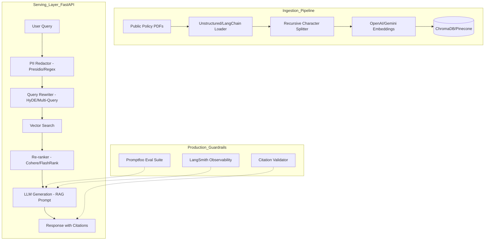

# Architecture Design: Gov-Policy-Insight (Production RAG)

This architecture is designed to meet the **"not just a POC"** requirements of enterprise/government AI roles. It focuses on **deterministic evaluation**, **PII safety**, and **observability**.

## 1. System Overview



## 2. Key Components

### A. Ingestion (The "Data" Pillar)
- **Tooling:** `LangChain` or `LlamaIndex`.
- **Strategy:** Recursive splitting with overlap (e.g., 1000 tokens, 100 overlap) to maintain context across chunks.
- **Metadata:** Store `source_url`, `page_number`, and `last_updated` to provide verifiable citations.

### B. Security & Safety (The "Gov" Pillar)
- **PII Redaction:** Use Microsoft's `Presidio` or simple regex patterns to ensure no sensitive names/numbers are passed to the LLM.
- **Prompt Injection Guard:** Basic validation to ensure the user query isn't trying to override the "Act as a helpful policy assistant" instructions.

### C. Retrieval Logic (The "Performance" Pillar)
- **Re-ranking:** Use a cross-encoder (like `FlashRank`) after the vector search. This significantly improves accuracy by sorting the top 10 results more intelligently before feeding them to the LLM.
- **Citations:** The system must return: "Based on the Fines Act 1996, Section 4..." instead of just a generic answer.

### D. Evaluation (The "Evidence" Pillar - CRITICAL)
*This is what wins the job.*
- **Framework:** `Promptfoo`.
- **Test Cases:** Create a `evals/` directory with a `config.yaml`. 
- **Assertions:**
    - `answer-relevance`: Does it actually answer the query?
    - `faithfulness`: Is the answer derived *only* from the retrieved context?
    - `no-hallucination`: Does it admit when it doesn't know the answer?

## 3. Recommended Tech Stack
- **Backend:** Python 3.11+, FastAPI.
- **Database:** ChromaDB (local/easy) or Pinecone (cloud/scale).
- **LLM:** Gemini 1.5 Pro (via Google Cloud) or OpenAI GPT-4o.
- **Monitoring:** LangSmith (for trace logs).
- **CI/CD:** GitHub Actions (running the Promptfoo evals on every push).

## 4. GitHub Folder Structure
```text
gov-policy-insight/
├── data/               # Publicly available PDFs
├── src/
│   ├── ingestion.py    # PDF to Vector Store
│   ├── main.py         # FastAPI App
│   ├── chains.py       # RAG Logic & Prompt Templates
│   └── security.py     # PII Redaction Logic
├── evals/
│   ├── promptfooconfig.yaml
│   └── test_cases.json
├── tests/              # Unit tests for code
├── .env.example
├── Dockerfile
└── README.md           # Architecture diagram & Eval results
```
